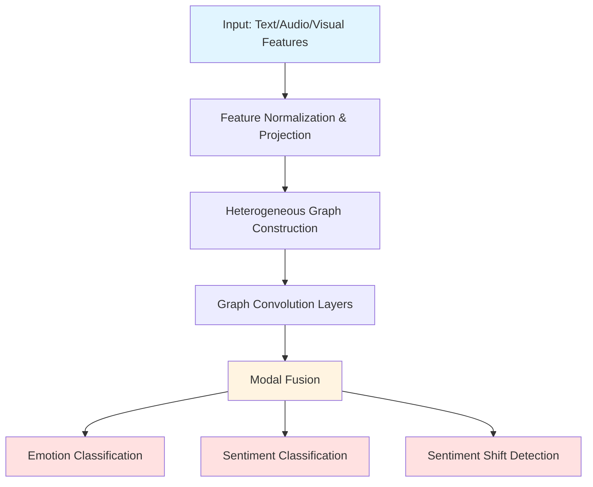
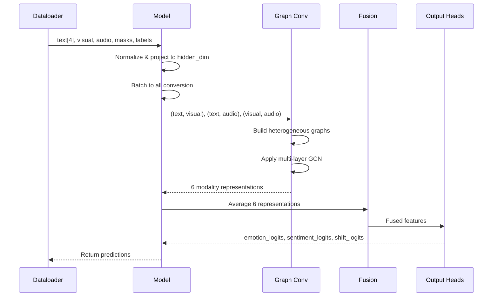

# GraphSmile Codebase: Comprehensive Explanation

## Overview

**GraphSmile** is a multimodal emotion recognition system that analyzes conversations by jointly modeling graph structure and sentiment dynamics. The system processes **text, audio, and visual** features from dialogue to predict emotions and sentiment shifts.

### Key Publication
- **Paper**: "Tracing intricate cues in dialogue: Joint graph structure and sentiment dynamics for multimodal emotion recognition"
- **Published in**: IEEE Transactions on Pattern Analysis and Machine Intelligence (TPAMI) 2025
- **Authors**: Jiang Li, Xiaoping Wang, Zhigang Zeng (Huazhong University of Science and Technology)

### Core Capabilities
1. **Multimodal Fusion**: Combines text, audio, and visual features
2. **Graph-based Learning**: Uses heterogeneous graph convolutions to model relationships between modalities
3. **Multi-task Learning**: Jointly predicts:
   - Emotion classification (6 or 7 classes depending on dataset)
   - Sentiment classification (3 classes: negative, neutral, positive)
   - Sentiment shift detection (binary: shift or no shift)

### Supported Datasets
- **IEMOCAP** (6 emotions): anger, happiness, sadness, neutral, frustration, excitement
- **IEMOCAP-4** (4 emotions): anger, happiness, sadness, neutral
- **MELD** (7 emotions): neutral, surprise, fear, sadness, joy, disgust, anger
- **CMU-MOSEI** (7 sentiment levels): continuous sentiment discretized into 7 bins

---

## Architecture Overview



---

## File-by-File Breakdown

### 1. `run.py` - Main Training Script (543 lines)

**Purpose**: Entry point for training and evaluation with distributed data parallel (DDP) support.

#### Key Components

**A. Argument Parser (Lines 27-117)**
```python
# Critical hyperparameters:
--dataset: IEMOCAP/IEMOCAP4/MELD/CMUMOSEI7
--textf_mode: How to use text features (textf0/concat4/sum4)
--hidden_dim: Hidden dimension size (256-512)
--win: [win_p, win_f] - Past/future window for graph construction
--heter_n_layers: [n1, n2, n3] - Layers for TV/TA/VA graphs
--shift_win: Window size for sentiment shift detection
--loss_type: emo_sen_sft (emotion + sentiment + shift)
--lambd: [λ1, λ2, λ3] - Loss weights
```

**B. Distributed Training Setup (Lines 135-169)**
- `init_ddp()`: Initializes distributed process group using NCCL backend
- `get_train_valid_sampler()`: Creates distributed samplers for train/validation split (90/10)
- `reduce_tensor()`: Synchronizes tensors across GPUs

**C. Main Training Loop (Lines 213-533)**

**Workflow**:
1. **Initialize model** with dataset-specific embedding dimensions
2. **Wrap model** in DistributedDataParallel (DDP)
3. **Create loss functions**: NLLLoss for emotion, sentiment, and shift
4. **Load data** using appropriate dataset class
5. **Training loop** (for each epoch):
   - Train on training set
   - Validate on validation set
   - Test on test set (only on rank 0)
   - Track best F1 scores
   - Save results every 10 epochs
6. **Save final results** to pickle file

**Dataset-Specific Configurations**:
```python
# IEMOCAP: embedding_dims = [1024, 342, 1582]  # text, visual, audio
# IEMOCAP4: embedding_dims = [1024, 512, 100]
# MELD: embedding_dims = [1024, 342, 300]
# CMUMOSEI7: embedding_dims = [1024, 35, 384]
```

---

### 2. `model.py` - GraphSmile Model (138 lines)

**Purpose**: Main model architecture that orchestrates all components.

#### Architecture Details

**A. Initialization (`__init__`, Lines 9-88)**

**Text Feature Processing**:
```python
# Supports multiple text feature modes:
- textf0/1/2/3: Use single text encoder
- concat2/4: Concatenate 2 or 4 text encoders
- sum2/4: Average 2 or 4 text encoders
```

**Dimension Projection Layers**:
- `dim_layer_t`: Projects text features to hidden_dim
- `dim_layer_v`: Projects visual features to hidden_dim
- `dim_layer_a`: Projects audio features to hidden_dim

**Three Heterogeneous Graph Convolution Networks**:
1. `hetergconv_tv`: Text-Visual graph
2. `hetergconv_ta`: Text-Audio graph
3. `hetergconv_va`: Visual-Audio graph

Each operates independently to capture cross-modal relationships.

**Output Heads**:
- `modal_fusion`: Fuses all graph outputs
- `emo_output`: Emotion classification (6 or 7 classes)
- `sen_output`: Sentiment classification (3 classes)
- `senshift`: Sentiment shift detection module

**B. Forward Pass (`forward`, Lines 90-137)**

**Step-by-step execution**:

1. **Text Feature Normalization**:
```python
# Apply BatchNorm to each text feature
for idx, bn in zip(self.used_t_indices, self.batchnorms_t):
    feat_bn = bn(feat.transpose(0, 1).reshape(-1, feature_dim_t))
```

2. **Feature Merging**:
```python
# Concatenate or average text features
if self.textf_mode in ['concat4', 'concat2']:
    merged_t_feat = torch.cat(used_t_features, dim=-1)
else:
    merged_t_feat = sum(used_t_features) / len(used_t_features)
```

3. **Dimension Projection**:
```python
featdim_t = self.dim_layer_t(merged_t_feat)
featdim_v = self.dim_layer_v(feature_v)
featdim_a = self.dim_layer_a(feature_a)
```

4. **Batch to All Conversion**:
```python
# Convert from [seq_len, batch, dim] to [total_nodes, dim]
emo_t, emo_v, emo_a = batch_to_all_tva(emo_t, emo_v, emo_a, dia_lengths, self.no_cuda)
```

5. **Heterogeneous Graph Convolutions**:
```python
# Process three modality pairs
featheter_tv, heter_edge_index = self.hetergconv_tv((emo_t, emo_v), dia_lengths, win_p, win_f)
featheter_ta, _ = self.hetergconv_ta((emo_t, emo_a), dia_lengths, win_p, win_f, heter_edge_index)
featheter_va, _ = self.hetergconv_va((emo_v, emo_a), dia_lengths, win_p, win_f, heter_edge_index)
```

6. **Modal Fusion** (Average of 6 modality representations):
```python
feat_fusion = (modal_fusion(tv_t) + modal_fusion(ta_t) + modal_fusion(tv_v) +
               modal_fusion(va_v) + modal_fusion(ta_a) + modal_fusion(va_a)) / 6
```

7. **Multi-task Outputs**:
```python
logit_emo = self.emo_output(feat_fusion)      # Emotion logits
logit_sen = self.sen_output(feat_fusion)      # Sentiment logits
logit_shift = self.senshift(feat_fusion, feat_fusion, dia_lengths)  # Shift logits
```

---

### 3. `module.py` - Core Neural Modules (289 lines)

**Purpose**: Implements graph convolution layers and sentiment shift detection.

#### A. `HeterGConv_Edge` (Lines 13-122)

**Purpose**: Multi-layer heterogeneous graph convolution with learnable edge weights.

**Key Methods**:

**1. `forward()` (Lines 27-57)**:
```python
# Concatenate modality features
feature = torch.cat(feature_tuple, dim=0)  # [n_nodes_total, dim]

# Build edge index if not provided
if edge_index is None:
    edge_index = self._heter_no_weight_edge(feature, num_modal, dia_lens, win_p, win_f)

# Learnable edge weights (dynamically sized)
edge_weight = self.edge_weight[:num_edges_needed]

# Convert to adjacency matrix with normalization
adj_weight = self._edge_index_to_adjacency_matrix(edge_index, edge_weight, num_nodes)

# Apply multiple graph convolution layers
for i in range(self.num_layers):
    feature = self.hetergcn_layers[i](feature, num_modal, adj_weight)
    feature_sum = feature_sum + self.fc_layers[i](feature)  # Residual connection
```

**2. `_heter_no_weight_edge()` (Lines 87-122)**:

**Purpose**: Constructs heterogeneous graph edges between different modalities.

**Algorithm**:
```python
# For each dialogue:
for dia_len in dia_lens:
    # For each modality pair (m, n):
    for m, n in permutations(range(num_modal), 2):
        # For each node in modality m:
        for j, node_m in enumerate(nodes_m):
            # Connect to nodes in modality n within window
            if win_p == -1 and win_f == -1:
                nodes_n = all nodes in n  # Fully connected
            else:
                nodes_n = nodes_n[max(j-win_p) : min(j+win_f+1)]  # Windowed
            
            # Add edges
            index_inter.extend(product([node_m], nodes_n))
```

**Window Parameters**:
- `win_p`: Past window (how many previous utterances to connect)
- `win_f`: Future window (how many future utterances to connect)
- `-1`: Connect to all utterances in the dialogue

**3. `_edge_index_to_adjacency_matrix()` (Lines 59-85)**:

**Purpose**: Converts edge list to normalized adjacency matrix.

```python
# Create sparse adjacency matrix
adj_sparse = torch.sparse_coo_tensor(edge_index, edge_weight, size=(num_nodes, num_nodes))
adj = adj_sparse.to_dense()

# Symmetric normalization: D^(-1/2) * A * D^(-1/2)
row_sum = torch.sum(adj, dim=1)
d_inv_sqrt = torch.pow(row_sum, -0.5)
d_inv_sqrt[d_inv_sqrt == float('inf')] = 0
d_inv_sqrt_mat = torch.diag_embed(d_inv_sqrt)
gcn_fact = torch.matmul(d_inv_sqrt_mat, torch.matmul(adj, d_inv_sqrt_mat))
```

#### B. `HeterGConvLayer` (Lines 125-140)

**Purpose**: Single graph convolution layer wrapper.

```python
def forward(self, feature, num_modal, adj_weight):
    if num_modal > 1:
        feature_heter = self.hetergconv(feature, adj_weight)  # Apply GCN
    else:
        feature_heter = feature  # Skip if only one modality
    return feature_heter
```

#### C. `SGConv_Our` (Lines 143-176)

**Purpose**: Simple Graph Convolution layer (similar to GCN).

**Forward Pass**:
```python
def forward(self, input, adj):
    support = torch.mm(input, self.weight)  # Linear transformation
    output = torch.spmm(adj, support)        # Graph convolution
    if self.bias is not None:
        return output + self.bias
    return output
```

#### D. `SenShift_Feat` (Lines 179-249)

**Purpose**: Detects sentiment shifts between utterances.

**Key Method: `_build_match_sample()` (Lines 201-249)**:

**Algorithm**:
```python
# For each dialogue:
for dia_len in dia_lens:
    # Divide dialogue into windows
    for i in range(ceil(dia_len / shift_win)):
        win = shift_win  # or remaining utterances
        
        # Create pairwise comparisons within window
        embeds_shift = torch.cat([
            embeds[start:start+win, None, :].repeat(1, win, 1),      # Broadcast rows
            embeds[None, start:start+win, :].repeat(win, 1, 1)       # Broadcast cols
        ], dim=-1)  # Concatenate to [win*win, 2*dim]
```

**Result**: For each pair of utterances in a window, concatenate their embeddings to predict if sentiment shifted.

#### E. `build_match_sen_shift_label()` (Lines 252-288)

**Purpose**: Creates ground truth labels for sentiment shift detection.

```python
# For each window:
dia_label_shift = (
    label_sen[start:start+win, None] != label_sen[None, start:start+win]
).long().view(-1)
# Returns 1 if sentiments differ, 0 if same
```

---

### 4. `dataloader.py` - Dataset Classes (312 lines)

**Purpose**: Loads and preprocesses multimodal features from pickle files.

#### Common Structure

All dataset classes follow this pattern:
1. Load pickle file containing preprocessed features
2. Split into train/test based on video IDs
3. Map emotion labels to sentiment labels
4. Return batched, padded sequences

#### A. `IEMOCAPDataset_BERT` (Lines 79-151)

**Pickle File Structure** (12 elements):
```python
(
    videoIDs,        # 0: List of dialogue IDs
    videoSpeakers,   # 1: Speaker info per utterance
    videoLabels,     # 2: Emotion labels (0-5)
    videoText0,      # 3: Text features (encoder 0)
    videoText1,      # 4: Text features (encoder 1)
    videoText2,      # 5: Text features (encoder 2)
    videoText3,      # 6: Text features (encoder 3)
    videoAudio,      # 7: Audio features
    videoVisual,     # 8: Visual features
    videoSentence,   # 9: Raw text transcripts
    trainVid,        # 10: Training dialogue IDs
    testVid,         # 11: Test dialogue IDs
)
```

**Emotion to Sentiment Mapping**:
```python
# IEMOCAP emotions: 0=anger, 1=happiness, 2=sadness, 3=neutral, 4=frustration, 5=excitement
if e in [1, 3, 5]:  # happiness, neutral, excitement
    sentiment = 0   # Negative (seems inverted in code)
elif e == 2:        # sadness
    sentiment = 1   # Neutral
elif e in [0, 4]:   # anger, frustration
    sentiment = 2   # Positive (seems inverted)
```

**`__getitem__()` Returns**:
```python
(
    text0_features,      # [seq_len, 1024]
    text1_features,      # [seq_len, 1024]
    text2_features,      # [seq_len, 1024]
    text3_features,      # [seq_len, 1024]
    visual_features,     # [seq_len, 342]
    audio_features,      # [seq_len, 1582]
    qmask,              # Speaker one-hot: [seq_len, 2]
    umask,              # Utterance mask: [seq_len] all 1s
    emotion_labels,     # [seq_len]
    sentiment_labels,   # [seq_len]
    video_id            # String
)
```

**`collate_fn()`**:
```python
# Pads sequences to max length in batch
# Returns list of tensors: [max_seq_len, batch_size, feature_dim]
```

#### B. `IEMOCAPDataset_BERT4` (Lines 8-76)

**Differences from IEMOCAP**:
- Only 1 text feature (not 4)
- 4 emotion classes instead of 6
- Different embedding dimensions: [1024, 512, 100]

**Pickle Structure** (9 elements):
```python
(videoIDs, videoSpeakers, videoLabels, videoText, videoAudio, 
 videoVisual, videoSentence, trainVid, testVid)
```

#### C. `MELDDataset_BERT` (Lines 154-220)

**Differences**:
- 7 emotion classes: neutral, surprise, fear, sadness, joy, disgust, anger
- Includes pre-computed sentiment labels (not derived from emotions)
- Pickle has 14 elements (includes validation set)

**Pickle Structure**:
```python
(videoIDs, videoSpeakers, videoLabels, videoSentiments,
 videoText0, videoText1, videoText2, videoText3,
 videoAudio, videoVisual, videoSentence,
 trainVid, testVid, validVid)
```

#### D. `CMUMOSEIDataset7` (Lines 223-311)

**Purpose**: Regression-based sentiment dataset discretized into 7 bins.

**Label Discretization**:
```python
# Continuous sentiment score -> 7 emotion classes
if a < -2:           emotion = 0  # Very negative
elif -2 <= a < -1:   emotion = 1
elif -1 <= a < 0:    emotion = 2
elif 0 <= a <= 0:    emotion = 3  # Neutral
elif 0 < a <= 1:     emotion = 4
elif 1 < a <= 2:     emotion = 5
elif a > 2:          emotion = 6  # Very positive

# Sentiment (3 classes)
if a < 0:            sentiment = 0  # Negative
elif a == 0:         sentiment = 1  # Neutral
elif a > 0:          sentiment = 2  # Positive
```

---

### 5. `trainer.py` - Training Loop (152 lines)

**Purpose**: Handles training/evaluation for one epoch.

#### Key Function: `train_or_eval_model()` (Lines 21-151)

**Parameters**:
- `model`: GraphSmile model
- `loss_function_emo/sen/shift`: Loss functions for each task
- `dataloader`: Train/valid/test loader
- `optimizer`: AdamW optimizer (None for eval)
- `train`: Boolean flag
- `loss_type`: How to combine losses
- `lambd`: Loss weights [λ_emo, λ_sen, λ_shift]

**Workflow**:

1. **Iterate over batches**:
```python
for iter, data in enumerate(dataloader):
    # Unpack data
    textf0, textf1, textf2, textf3, visuf, acouf, qmask, umask, 
    label_emotion, label_sentiment = data[:-1]
```

2. **Extract dialogue lengths**:
```python
dia_lengths = []
for j in range(umask.size(1)):  # For each dialogue in batch
    dia_lengths.append((umask[:, j] == 1).nonzero().tolist()[-1][0] + 1)
```

3. **Forward pass**:
```python
logit_emo, logit_sen, logit_sft, extracted_feature = model(
    textf0, textf1, textf2, textf3, visuf, acouf, umask, qmask, dia_lengths
)
```

4. **Compute losses**:
```python
prob_emo = F.log_softmax(logit_emo, -1)
loss_emo = loss_function_emo(prob_emo, label_emo)

prob_sen = F.log_softmax(logit_sen, -1)
loss_sen = loss_function_sen(prob_sen, label_sen)

prob_sft = F.log_softmax(logit_sft, -1)
label_sft = build_match_sen_shift_label(shift_win, dia_lengths, label_sen)
loss_sft = loss_function_shift(prob_sft, label_sft)
```

5. **Combine losses** based on `loss_type`:
```python
if loss_type == 'emo_sen_sft':
    loss = lambd[0] * loss_emo + lambd[1] * loss_sen + lambd[2] * loss_sft
elif loss_type == 'epoch':
    # Gradually shift from auxiliary to main task
    loss = (epoch/epochs) * (lambd[0] * loss_emo) + 
           (1 - epoch/epochs) * (lambd[1] * loss_sen + lambd[2] * loss_sft)
elif loss_type == 'auto':
    # Automatic loss weighting
    awl = AutomaticWeightedLoss(3)
    loss = awl(loss_emo, loss_sen, loss_sft)
```

6. **Backward pass** (if training):
```python
if train:
    loss.backward()
    optimizer.step()
```

7. **Compute metrics**:
```python
avg_acc_emo = accuracy_score(labels_emo, preds_emo) * 100
avg_f1_emo = f1_score(labels_emo, preds_emo, average='weighted') * 100
```

**Returns**:
```python
(avg_loss, labels_emo, preds_emo, avg_acc_emo, avg_f1_emo,
 labels_sen, preds_sen, avg_acc_sen, avg_f1_sen,
 avg_acc_sft, avg_f1_sft, vids, initial_feats, extracted_feats)
```

---

### 6. `utils.py` - Utility Functions (50 lines)

#### A. `batch_to_all_tva()` (Lines 5-24)

**Purpose**: Converts batched sequences to flat node list.

**Input**: `[seq_len, batch_size, dim]`  
**Output**: `[total_nodes, dim]`

```python
def batch_to_all_tva(feature_t, feature_v, feature_a, lengths, no_cuda):
    node_feature_t, node_feature_v, node_feature_a = [], [], []
    
    for j in range(batch_size):
        # Extract only valid utterances (based on dialogue length)
        node_feature_t.append(feature_t[:lengths[j], j, :])
        node_feature_v.append(feature_v[:lengths[j], j, :])
        node_feature_a.append(feature_a[:lengths[j], j, :])
    
    # Concatenate all dialogues
    node_feature_t = torch.cat(node_feature_t, dim=0)  # [sum(lengths), dim]
    return node_feature_t, node_feature_v, node_feature_a
```

#### B. `AutomaticWeightedLoss` (Lines 27-49)

**Purpose**: Learns optimal loss weights during training.

**Formula**:
```python
loss_sum = Σ (0.5 / σ_i² * loss_i + log(1 + σ_i²))
```

Where `σ_i` are learnable parameters (uncertainty for each task).

**Usage**:
```python
awl = AutomaticWeightedLoss(num=3)  # 3 tasks
total_loss = awl(loss_emo, loss_sen, loss_sft)
```

---

### 7. `inspect_pkl.py` - Data Inspection Tool (64 lines)

**Purpose**: Utility to inspect pickle file structure.

**Functions**:

1. **`inspect_data()`**: Recursively prints data structure
2. **`deep_inspect()`**: Shows detailed sample information

**Example Output**:
```
Structure size: 12
--- Conversation: Ses02F_script01_3 ---
Speaker: ['M', 'F', 'M', 'F']
Labels:  [3, 2, 0, 1]
Text0[0] shape: (1024,)
Audio[0] shape: (1582,)
Visual[0] shape: (342,)
First Transcript: "Hello, how are you?"
```

---

## Data Flow Diagram



---

## Training Configuration Examples

### IEMOCAP-6
```bash
python run.py --gpu 0 --dataset IEMOCAP --epochs 120 \
  --textf_mode textf0 --loss_type emo_sen_sft \
  --lr 1e-04 --batch_size 16 --hidden_dim 512 \
  --win 17 17 --heter_n_layers 7 7 7 --drop 0.2 \
  --shift_win 19 --lambd 1.0 1.0 0.7
```

**Explanation**:
- `textf_mode textf0`: Use only first text encoder
- `win 17 17`: Connect to 17 past and 17 future utterances
- `heter_n_layers 7 7 7`: 7 layers for each graph type
- `shift_win 19`: Window of 19 utterances for shift detection
- `lambd 1.0 1.0 0.7`: Equal weight for emotion/sentiment, lower for shift

### MELD
```bash
python run.py --gpu 0 --dataset MELD --epochs 50 \
  --textf_mode textf0 --loss_type emo_sen_sft \
  --lr 7e-05 --batch_size 16 --hidden_dim 384 \
  --win 3 3 --heter_n_layers 5 5 5 --drop 0.2 \
  --shift_win 3 --lambd 1.0 0.5 0.2
```

**Explanation**:
- Smaller windows (`win 3 3`) for shorter dialogues
- Lower shift weight (`lambd 1.0 0.5 0.2`)
- Fewer layers (5 vs 7) to prevent overfitting

---

## Key Design Decisions

### 1. Heterogeneous Graph Construction

**Why 3 separate graphs?**
- Each modality pair captures different relationships
- Text-Visual: Facial expressions matching words
- Text-Audio: Prosody matching sentiment
- Visual-Audio: Multimodal emotion cues

### 2. Multi-task Learning

**Why predict emotion + sentiment + shift?**
- **Emotion**: Main task (6-7 classes)
- **Sentiment**: Auxiliary task (3 classes) - easier, helps regularization
- **Shift**: Captures temporal dynamics

### 3. Windowed Graph Connections

**Why not fully connected?**
- Reduces computational cost (O(n²) → O(n·w))
- Focuses on local context
- Prevents overfitting on long dialogues

### 4. Learnable Edge Weights

**Why not fixed weights?**
- Different edges have different importance
- Model learns which cross-modal connections matter
- Adapts to dataset characteristics

---

## Common Hyperparameter Patterns

| Dataset | Hidden Dim | Window | Layers | Shift Win | Lambda |
|---------|-----------|--------|--------|-----------|--------|
| IEMOCAP-6 | 512 | 17, 17 | 7, 7, 7 | 19 | 1.0, 1.0, 0.7 |
| IEMOCAP-4 | 256 | 5, 5 | 4, 4, 4 | 10 | 1.0, 0.6, 0.6 |
| MELD | 384 | 3, 3 | 5, 5, 5 | 3 | 1.0, 0.5, 0.2 |
| CMUMOSEI | 256 | 5, 5 | 2, 2, 2 | 2 | 1.0, 0.8, 1.0 |

**Observations**:
- Larger datasets → more layers
- Longer dialogues → larger windows
- Emotion-focused → higher emotion lambda

---

## Potential Extensions

1. **Attention Mechanisms**: Replace average fusion with attention
2. **Temporal Modeling**: Add LSTM/Transformer before graph layers
3. **Speaker Modeling**: Incorporate speaker embeddings
4. **Cross-Dialogue Learning**: Model relationships between dialogues
5. **Self-Supervised Pretraining**: Pretrain graph encoder on unlabeled data

---

## Summary

GraphSmile is a sophisticated multimodal emotion recognition system that:

1. **Processes** text, audio, and visual features from conversational data
2. **Constructs** heterogeneous graphs to model cross-modal relationships
3. **Applies** multi-layer graph convolutions to learn joint representations
4. **Predicts** emotions, sentiments, and sentiment shifts simultaneously
5. **Trains** using distributed data parallel for efficiency

The key innovation is the **joint modeling of graph structure and sentiment dynamics**, allowing the model to capture both spatial (cross-modal) and temporal (sentiment shift) patterns in dialogue.
