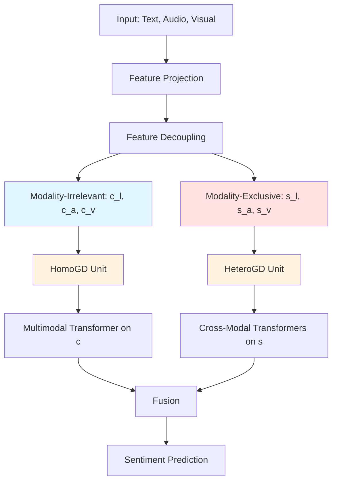

# DMD (Decoupled Multimodal Distilling) - Comprehensive Analysis

## Publication Information

**Title**: Decoupled Multimodal Distilling for Emotion Recognition  
**Conference**: CVPR 2023 (Highlight Paper - 10% of accepted papers, 2.5% of submissions)  
**Authors**: Yong Li, Yuanzhi Wang, Zhen Cui  
**Paper**: https://arxiv.org/abs/2303.13802  
**Repository**: https://github.com/jubaer36/DMD  

---

## Overview

**DMD** is a novel approach for multimodal emotion recognition (MER) that addresses the challenge of heterogeneous modalities (text, audio, visual) through **decoupled knowledge distillation**. Unlike traditional methods that treat all modalities uniformly, DMD recognizes that different modalities contribute differently to emotion recognition and implements specialized distillation strategies.

### Core Innovation

The key innovation is **decoupling each modality's representation into two complementary spaces**:

1. **Modality-Irrelevant Space** (c): Common features shared across modalities
2. **Modality-Exclusive Space** (s): Unique features specific to each modality

Each space uses a dedicated **Graph Distillation Unit (GD-Unit)** with learnable edge weights for flexible cross-modal knowledge transfer.

---

## Problem Motivation

### Challenge: Modality Heterogeneity

From the paper's motivation figure:
- **Language (L)**: Strong performance (best unimodal accuracy)
- **Visual (V)**: Moderate performance
- **Audio (A)**: Weakest performance

**Traditional cross-modal distillation** treats all modalities equally, which is suboptimal because:
- Weak modalities (audio) may degrade strong modalities (language)
- Fixed distillation weights cannot adapt to sample-specific patterns
- Ignores modality-specific vs. shared information

**DMD's Solution**:
- Decouple representations into shared (c) and exclusive (s) spaces
- Use **learnable graph edges** to automatically determine distillation weights
- Apply specialized distillation for each space (HomoGD for c, HeteroGD for s)

---

## Architecture



---

## Detailed Component Breakdown

### 1. Feature Projection (Initial Processing)

**Purpose**: Project raw features to unified dimension.

```python
# Temporal convolutional layers
self.proj_l = nn.Conv1d(orig_d_l, d_l, kernel_size=k_l, padding=0)
self.proj_a = nn.Conv1d(orig_d_a, d_a, kernel_size=k_a, padding=0)
self.proj_v = nn.Conv1d(orig_d_v, d_v, kernel_size=k_v, padding=0)
```

**Input Dimensions** (MOSI/MOSEI):
- Text (BERT): 768-dim
- Audio: 74-dim (COVAREP features)
- Visual: 35-dim (Facet features)

**Output**: All modalities projected to `d_l = d_a = d_v = 32` (default)

---

### 2. Feature Decoupling

**Purpose**: Separate each modality into shared and exclusive components.

#### 2.1 Modality-Exclusive Encoder
```python
self.encoder_s_l = nn.Conv1d(d_l, d_l, kernel_size=1)
self.encoder_s_v = nn.Conv1d(d_v, d_v, kernel_size=1)
self.encoder_s_a = nn.Conv1d(d_a, d_a, kernel_size=1)
```

**Output**: `s_l, s_v, s_a` - modality-specific features

#### 2.2 Modality-Irrelevant Encoder
```python
self.encoder_c = nn.Conv1d(d_l, d_l, kernel_size=1)
```

**Output**: `c_l, c_v, c_a` - shared features across modalities

#### 2.3 Reconstruction Decoder

**Purpose**: Ensure decoupled features preserve original information.

```python
self.decoder_l = nn.Conv1d(d_l * 2, d_l, kernel_size=1)
self.decoder_v = nn.Conv1d(d_v * 2, d_v, kernel_size=1)
self.decoder_a = nn.Conv1d(d_a * 2, d_a, kernel_size=1)
```

**Reconstruction Loss**:
```python
x_l_reconstructed = decoder_l(torch.cat([c_l, s_l], dim=1))
loss_recon_l = MSE(x_l_reconstructed, x_l_original)
```

**Orthogonality Constraint**:
```python
# Ensure c and s are independent
loss_ortho = cosine_similarity(c_l, s_l) + cosine_similarity(c_v, s_v) + cosine_similarity(c_a, s_a)
```

---

### 3. Graph Distillation Units

#### 3.1 HomoGD (Homogeneous Graph Distillation)

**Purpose**: Distill knowledge in modality-irrelevant space (c).

**Architecture**:
```python
class DistillationKernel(nn.Module):
    def __init__(self, n_classes, hidden_size, gd_size, to_idx, from_idx, gd_prior, ...):
        self.W_logit = nn.Linear(n_classes, gd_size)  # Project logits
        self.W_repr = nn.Linear(hidden_size, gd_size)  # Project representations
        self.W_edge = nn.Linear(gd_size * 4, 1)       # Compute edge weights
```

**Forward Pass**:
```python
def forward(self, logits, reprs):
    # logits: [3, batch, 1] - predictions from each modality
    # reprs: [3, batch, hidden_size] - representations
    
    # Project to graph space
    z_logits = W_logit(logits)  # [3, batch, gd_size]
    z_reprs = W_repr(reprs)     # [3, batch, gd_size]
    z = torch.cat([z_logits, z_reprs], dim=-1)  # [3, batch, 2*gd_size]
    
    # Compute edge weights for all pairs
    edges = []
    for j in to_idx:  # Target modality
        for i in from_idx:  # Source modality
            if i != j:
                e = W_edge(torch.cat([z[j], z[i]], dim=-1))  # [batch, 1]
                edges.append(e)
    
    edges = torch.cat(edges, dim=1)  # [batch, 6] for 3 modalities
    edges = F.softmax(edges * alpha, dim=1)  # Normalize
    return edges
```

**Edge Interpretation** (for 3 modalities):
- `e[0]`: L ← A (language distilled from audio)
- `e[1]`: L ← V (language distilled from visual)
- `e[2]`: A ← L (audio distilled from language)
- `e[3]`: A ← V (audio distilled from visual)
- `e[4]`: V ← L (visual distilled from language)
- `e[5]`: V ← A (visual distilled from audio)

**Distillation Loss**:
```python
def distillation_loss(self, logits, reprs, edges):
    # 1. Regularization: encourage edges to match prior
    loss_reg = (edges.mean(1) - gd_prior).pow(2).sum() * gd_reg
    
    # 2. Logit distillation (weighted by edge)
    loss_logit = 0
    for j in to_idx:
        for i in from_idx:
            if i != j:
                w = edges[edge_idx] + gd_prior[edge_idx]
                loss_logit += w_losses[0] * distance_metric(logits[j], logits[i], metric, w)
    
    # 3. Representation distillation
    loss_repr = 0
    for j in to_idx:
        for i in from_idx:
            if i != j:
                w = edges[edge_idx] + gd_prior[edge_idx]
                loss_repr += w_losses[1] * distance_metric(reprs[j], reprs[i], metric, w)
    
    return loss_reg, loss_logit, loss_repr
```

**Hyperparameters** (from run.py):
```python
args.gd_size_low = 64           # Hidden size for HomoGD
args.w_losses_low = [1, 10]     # Weights: [logit_loss, repr_loss]
args.metric_low = 'l1'          # Distance metric
gd_prior = softmax([0,0,1,0,1,0], 0.25)  # Prior: favor L→A, L→V
gd_reg = 10                     # Regularization strength
```

#### 3.2 HeteroGD (Heterogeneous Graph Distillation)

**Purpose**: Distill knowledge in modality-exclusive space (s).

**Key Differences from HomoGD**:
1. **Input**: Uses concatenated features from cross-modal transformers
2. **Hidden size**: `2 * d_a` (larger to capture cross-modal interactions)
3. **Prior**: Different edge preferences

**Hyperparameters**:
```python
args.gd_size_high = 32          # Hidden size for HeteroGD
args.w_losses_high = [1, 10]    # Weights: [logit_loss, repr_loss]
args.metric_high = 'l1'         # Distance metric
gd_prior = softmax([0,0,1,0,1,1], 0.25)  # Prior: favor L→A, L→V, V→A
```

**Why V→A emerges**: Visual features are enhanced by multimodal transformers, making them useful for distilling audio.

---

### 4. Multimodal Transformers

#### 4.1 Self-Attention on Modality-Irrelevant Features

```python
self.self_attentions_c_l = TransformerEncoder(embed_dim=d_l, num_heads=4, layers=4)
self.self_attentions_c_v = TransformerEncoder(embed_dim=d_v, num_heads=4, layers=4)
self.self_attentions_c_a = TransformerEncoder(embed_dim=d_a, num_heads=4, layers=4)

# Forward
c_l_attn = self.self_attentions_c_l(c_l)
c_v_attn = self.self_attentions_c_v(c_v)
c_a_attn = self.self_attentions_c_a(c_a)

# Fusion
c_fused = torch.cat([c_l_attn, c_v_attn, c_a_attn], dim=-1)  # [batch, 3*d_l]
```

#### 4.2 Cross-Modal Attention on Modality-Exclusive Features

```python
# 6 cross-modal transformers
self.trans_l_with_a = TransformerEncoder(...)  # L attends to A
self.trans_l_with_v = TransformerEncoder(...)  # L attends to V
self.trans_a_with_l = TransformerEncoder(...)  # A attends to L
self.trans_a_with_v = TransformerEncoder(...)  # A attends to V
self.trans_v_with_l = TransformerEncoder(...)  # V attends to L
self.trans_v_with_a = TransformerEncoder(...)  # V attends to A

# Forward
s_l_with_a = self.trans_l_with_a(s_l, s_a)
s_l_with_v = self.trans_l_with_v(s_l, s_v)
s_l_enhanced = torch.cat([s_l_with_a, s_l_with_v], dim=-1)  # [batch, 2*d_l]
```

#### 4.3 Memory Transformers

```python
self.trans_l_mem = TransformerEncoder(embed_dim=2*d_l, layers=3)
self.trans_a_mem = TransformerEncoder(embed_dim=2*d_a, layers=3)
self.trans_v_mem = TransformerEncoder(embed_dim=2*d_v, layers=3)

# Apply to enhanced exclusive features
s_l_final = self.trans_l_mem(s_l_enhanced)
```

---

### 5. Prediction Heads

#### 5.1 HomoGD Predictions (from c features)

```python
# For each modality
def predict_low(c_x):
    h = F.dropout(F.relu(proj1_x_low(c_x)), p=0.1)
    h = F.dropout(F.relu(proj2_x_low(h)), p=0.1)
    logit = out_layer_x_low(h)
    return logit

logit_l_low = predict_low(c_l)
logit_v_low = predict_low(c_v)
logit_a_low = predict_low(c_a)
```

#### 5.2 HeteroGD Predictions (from s features)

```python
def predict_high(s_x_enhanced):
    h = F.dropout(F.relu(proj1_x_high(s_x_enhanced)), p=0.1)
    h = F.dropout(F.relu(proj2_x_high(h)), p=0.1)
    logit = out_layer_x_high(h)
    return logit

logit_l_high = predict_high(s_l_final)
logit_v_high = predict_high(s_v_final)
logit_a_high = predict_high(s_a_final)
```

#### 5.3 Final Ensemble Prediction

```python
# Weighted combination
w_l = torch.sigmoid(weight_l(s_l_final))
w_v = torch.sigmoid(weight_v(s_v_final))
w_a = torch.sigmoid(weight_a(s_a_final))
w_c = torch.sigmoid(weight_c(c_fused))

# Combine all features
combined = torch.cat([
    w_l * s_l_final,
    w_v * s_v_final,
    w_a * s_a_final,
    w_c * c_fused
], dim=-1)

# Final prediction
h = F.dropout(F.relu(proj1(combined)), p=0.1)
h = F.dropout(F.relu(proj2(h)), p=0.1)
output = out_layer(h)  # [batch, 1] - sentiment score
```

---

## Training Procedure

### Loss Function

```python
# 1. Task loss (regression for sentiment)
loss_task = MSE(output, target)

# 2. Reconstruction loss
loss_recon = MSE(x_l_recon, x_l) + MSE(x_v_recon, x_v) + MSE(x_a_recon, x_a)

# 3. Orthogonality loss
loss_ortho = cosine_sim(c_l, s_l) + cosine_sim(c_v, s_v) + cosine_sim(c_a, s_a)

# 4. HomoGD distillation losses
loss_reg_low, loss_logit_low, loss_repr_low = model_distill_homo.distillation_loss(
    logits=[logit_l_low, logit_v_low, logit_a_low],
    reprs=[c_l, c_v, c_a],
    edges=edges_low
)

# 5. HeteroGD distillation losses
loss_reg_high, loss_logit_high, loss_repr_high = model_distill_hetero.distillation_loss(
    logits=[logit_l_high, logit_v_high, logit_a_high],
    reprs=[s_l_final, s_v_final, s_a_final],
    edges=edges_high
)

# Total loss
loss = (loss_task + 
        λ_recon * loss_recon + 
        λ_ortho * loss_ortho +
        loss_reg_low + loss_logit_low + loss_repr_low +
        loss_reg_high + loss_logit_high + loss_repr_high)
```

### Training Script (train.py)

```python
from run import DMD_run

DMD_run(
    model_name='dmd',
    dataset_name='mosei',  # or 'mosi'
    is_tune=False,
    seeds=[1111],
    model_save_dir="./pt",
    res_save_dir="./result",
    log_dir="./log",
    mode='train',
    is_distill=True  # Enable distillation
)
```

### Testing Script (test.py)

```python
from run import DMD_run

DMD_run(
    model_name='dmd',
    dataset_name='mosi',
    mode='test',
    is_distill=False  # Disable distillation during testing
)
```

---

## Datasets

### CMU-MOSI (Multimodal Opinion Sentiment Intensity)

- **Task**: Sentiment regression [-3, +3]
- **Samples**: 2,199 opinion video clips
- **Modalities**: Text (BERT), Audio (COVAREP), Visual (Facet)
- **Splits**: Train/Valid/Test

### CMU-MOSEI (Multimodal Opinion Sentiment and Emotion Intensity)

- **Task**: Sentiment regression [-3, +3]
- **Samples**: 23,453 video clips
- **Modalities**: Text (BERT), Audio (COVAREP), Visual (Facet)
- **Larger and more diverse** than MOSI

**Data Format** (aligned):
```python
{
    'text': [batch, 50, 768],    # BERT embeddings
    'audio': [batch, 50, 74],    # COVAREP features
    'visual': [batch, 50, 35],   # Facet features
    'labels': [batch, 1]         # Sentiment score
}
```

---

## Key Insights from Learned Graph Edges

### HomoGD Edges (Modality-Irrelevant Space)

**Dominant Edges**: L → A, L → V

**Interpretation**:
- Language features are most discriminative
- Audio and visual modalities benefit from language distillation
- Weak modalities (A, V) learn from strong modality (L)

### HeteroGD Edges (Modality-Exclusive Space)

**Dominant Edges**: L → A, L → V, **V → A**

**Interpretation**:
- Language still provides strong guidance
- **V → A emerges**: Visual features enhanced by cross-modal transformers become useful for audio
- Demonstrates adaptive distillation based on feature quality

---

## Comparison with GraphSmile

| Aspect | DMD | GraphSmile |
|--------|-----|------------|
| **Task** | Sentiment regression | Emotion classification |
| **Datasets** | MOSI, MOSEI | IEMOCAP, MELD |
| **Modalities** | Text, Audio, Visual | Text, Audio, Visual |
| **Core Idea** | Decoupled distillation | Heterogeneous graphs + sentiment dynamics |
| **Feature Spaces** | 2 spaces (c, s) | Single space |
| **Graph Type** | Dynamic distillation graph | Static heterogeneous graph |
| **Edge Weights** | Learnable (per sample) | Learnable (shared) |
| **Multi-task** | No | Yes (emotion + sentiment + shift) |
| **Distillation** | Yes (core contribution) | No |
| **Transformers** | Cross-modal attention | No (uses GCN) |

**Similarities**:
- Both use graph-based multimodal fusion
- Both have learnable edge weights
- Both process text, audio, visual features

**Key Differences**:
- **DMD**: Focuses on knowledge distillation with decoupled spaces
- **GraphSmile**: Focuses on temporal dynamics and multi-task learning

---

## Code Structure

```
DMD/
├── train.py                    # Training entry point
├── test.py                     # Testing entry point
├── run.py                      # Main orchestration (DMD_run function)
├── config.py                   # Configuration management
├── data_loader.py              # Dataset loading
├── config/
│   └── config.json             # Hyperparameters
├── dataset/                    # Data directory (MOSI, MOSEI)
├── trains/
│   ├── ATIO.py                 # Training wrapper
│   └── singleTask/
│       ├── DMD.py              # Training loop
│       ├── model/
│       │   └── dmd.py          # DMD model architecture
│       ├── distillnets/
│       │   ├── get_distillation_kernel.py       # HeteroGD
│       │   └── get_distillation_kernel_homo.py  # HomoGD
│       └── utils/
└── utils/
    ├── functions.py            # Utility functions
    └── metricsTop.py           # Evaluation metrics
```

---

## Hyperparameters

### Model Architecture
```python
dst_feature_dim = 32            # Unified feature dimension
nheads = 4                      # Transformer attention heads
nlevels = 4                     # Transformer layers
attn_dropout = 0.1              # Attention dropout
relu_dropout = 0.1              # ReLU dropout
embed_dropout = 0.25            # Embedding dropout
```

### Graph Distillation
```python
# HomoGD
gd_size_low = 64                # Graph hidden size
w_losses_low = [1, 10]          # [logit_weight, repr_weight]
metric_low = 'l1'               # Distance metric
gd_prior_low = softmax([0,0,1,0,1,0], 0.25)
gd_reg = 10                     # Regularization strength

# HeteroGD
gd_size_high = 32
w_losses_high = [1, 10]
metric_high = 'l1'
gd_prior_high = softmax([0,0,1,0,1,1], 0.25)
```

### Training
```python
learning_rate = 1e-3
batch_size = 32
epochs = 100
optimizer = Adam
```

---

## Results (from Paper)

### MOSI Dataset

| Method | MAE ↓ | Corr ↑ | Acc-2 ↑ | F1 ↑ |
|--------|-------|--------|---------|------|
| MULT | 0.861 | 0.698 | 83.0 | 82.8 |
| **DMD** | **0.713** | **0.766** | **85.9** | **85.7** |

### MOSEI Dataset

| Method | MAE ↓ | Corr ↑ | Acc-2 ↑ | F1 ↑ |
|--------|-------|--------|---------|------|
| MULT | 0.580 | 0.703 | 82.5 | 82.3 |
| **DMD** | **0.538** | **0.765** | **84.4** | **84.3** |

**Key Improvements**:
- Consistent gains across all metrics
- Particularly strong on correlation (Corr)
- Demonstrates effectiveness of decoupled distillation

---

## Key Takeaways

1. **Decoupling is Powerful**: Separating modality-irrelevant and modality-exclusive features enables specialized processing

2. **Learnable Distillation**: Dynamic edge weights adapt to sample-specific patterns, outperforming fixed weights

3. **Two-Stage Distillation**: HomoGD and HeteroGD target different aspects of multimodal fusion

4. **Cross-Modal Enhancement**: Transformers enhance weak modalities before distillation

5. **Adaptive Knowledge Transfer**: Graph edges automatically learn which modalities should distill to which

---

## Potential Extensions

1. **Apply to Classification**: Extend to discrete emotion classification (like GraphSmile)
2. **Temporal Modeling**: Add LSTM/GRU for sequential dependencies
3. **More Modalities**: Incorporate physiological signals (EEG, heart rate)
4. **Self-Supervised Pretraining**: Pretrain decoupling on unlabeled data
5. **Attention Visualization**: Visualize learned edge weights for interpretability

---

## Summary

DMD is a sophisticated multimodal emotion recognition system that:

1. **Decouples** each modality into shared and exclusive spaces
2. **Distills** knowledge using learnable graph edges
3. **Adapts** distillation weights per sample
4. **Enhances** weak modalities through cross-modal transformers
5. **Achieves** state-of-the-art results on MOSI/MOSEI

The key innovation is recognizing that **not all cross-modal knowledge transfer is equal** and using graph-based distillation to learn optimal transfer patterns.
